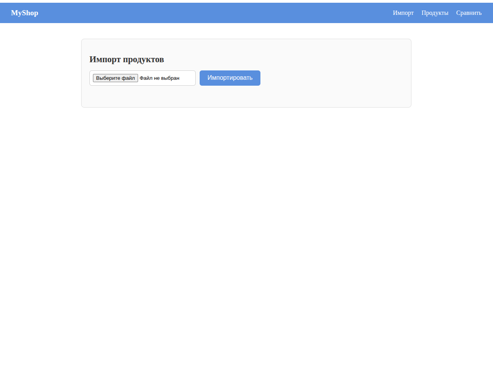
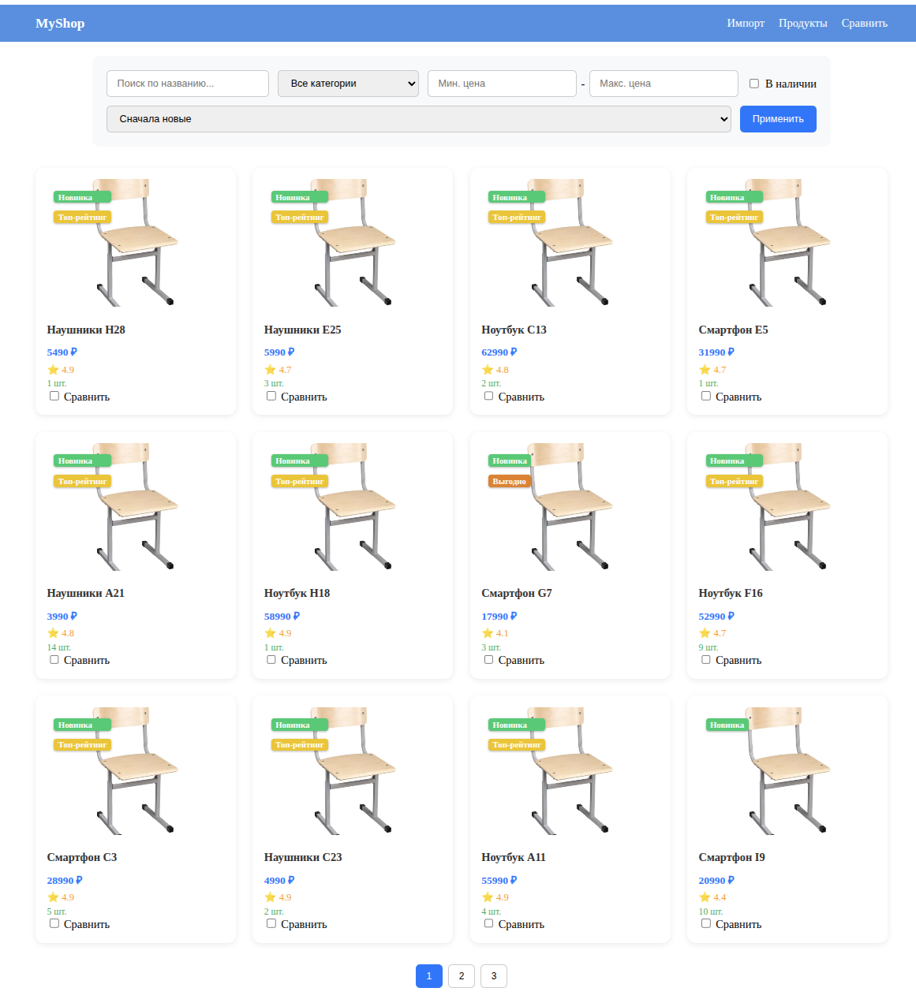
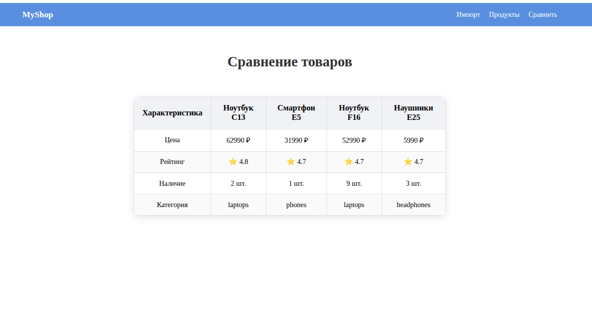

# Старта – тестовое задание

## 📌 Описание

Целью тестового задания было написание серверной части веб-приложения **на PHP без фреймворков и сторонних библиотек**, а также клиентской части **на HTML/JS без фреймворков**.

---

## ✅ Сделанные функциональные требования

* ✅ Импорт данных
* ✅ Публичный каталог
* ✅ Состояние в URL
* ✅ “Умные” бейджи
* ✅ Сравнение товаров
* ❌ Отчёты

---

## 📸 Скриншоты

| Импорт                 | Главная страница                  | Страница сравнения                  |
|------------------------|-----------------------------------|-------------------------------------|
|  |  |  |
---

## 🛠 Сборка проекта

1. Клонируйте репозиторий

```bash
git clone https://github.com/waffflezz/starta-test.git
cd starta-test
```

2. Скопируйте `.env.example` в `.env`

```bash
cp .env.example .env
```

3. Запустите Docker контейнеры

```bash
cd .docker
docker compose --env-file ./../.env up -d
```

4. Зайдите в контейнер и установите зависимости

```bash
docker exec -it starta-php /bin/bash
```

5. Установите зависимости проекта

```bash
composer install
```

6. Примените миграции

```bash
cd bin
php migrate.php
```

7. Выйдите из контейнера

```bash
exit
```

---

## 🌐 Доступ к проекту

* Веб-приложение: [http://localhost:80/](http://localhost:80/)
* PhpMyAdmin: [http://localhost:8080/](http://localhost:8080/)

---

## 💎 Киллер-фичи

* На бэкенде написан миниатюрный фреймворк, который позволяет при необходимости легко расширять приложение.
* На фронтенде сравнение реализовано по аналогии со сравнением товаров на сайте DNS, но в упрощённом варианте.

---

## 🔧 Что можно улучшить

* Код фронтенда можно улучшить, например добавить SCSS и собирать его в минифицированный CSS, а также оптимизировать JS.
* На бэкенде можно добавить механизм DI и лучше следовать принципам чистой архитектуры.
